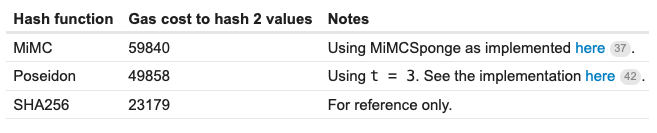
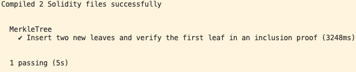
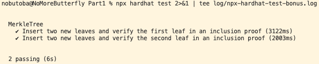
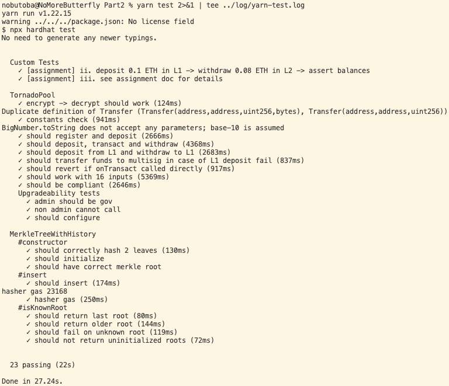
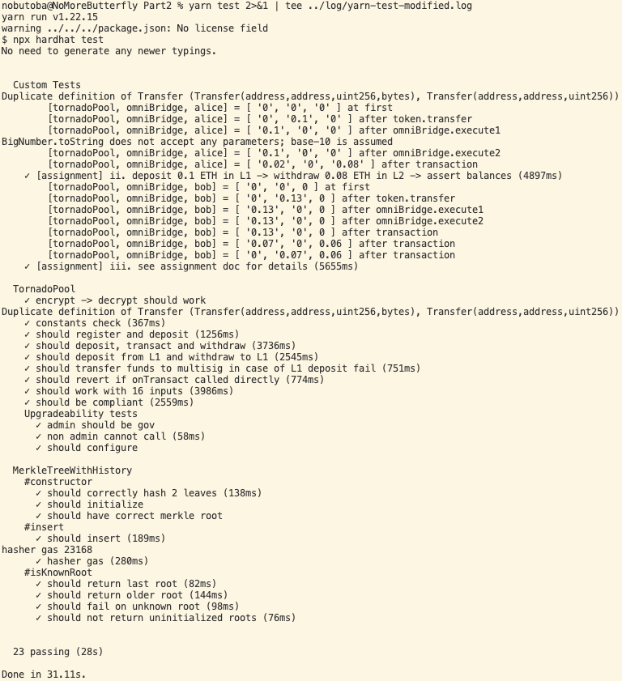

# Week 2 Assignment

1. Enrolled email address: tba
1. Discord handle (e.g. cs#6500): tba

## Part 1. Hashes and Merkle Tree

> In this question, we will visit the different types of hashes available in Circom (and Solidity) and grow some Merkle trees!

### Part 1 Q1

> Based on the resources we provide you as well as any additional research you have done, rank the four hashes and provide explanations in four different aspects: gas cost, capacity, proof generation efficiency, and proof size.
<!-- > Your response should look like this:
>
> - Gas cost
>
>   e.g. SHA256 < MiMC ≈ Poseidon < Pedersen (inaccurate, do not copy)\
>   Explanations/references: ....
>
> - Capacity
>
>   ... < or ≈ ... < or ≈ ... < or ≈ ...\
>   Explanations/references: ....
>
> - Proof generation efficiency
>
>   ... < or ≈ ... < or ≈ ... < or ≈ ...\
>   Explanations/references: ....
>
> - Proof size
>   ... < or ≈ ... < or ≈ ... < or ≈ ...\
>   Explanations/references: .... -->

Before comparing the four hashes,
the following table helps describing what the individual hashes stand for.

| hash function(s) | website | paper | implementation |
| - | - | - | - |
| SHA256 | [Wikipedia](https://en.wikipedia.org/wiki/SHA-2) | [pdf](https://web.archive.org/web/20160330153520/https://www.staff.science.uu.nl/~werkh108/docs/study/Y5_07_08/infocry/project/Cryp08.pdf) | [`sha256.circom`](https://github.com/iden3/circomlib/blob/master/circuits/sha256/sha256.circom), [`sha256_2.circom`](https://github.com/iden3/circomlib/blob/master/circuits/sha256/sha256_2.circom) |
| MiMC | [Arnab Roy](https://byt3bit.github.io/primesym) | [pdf](https://eprint.iacr.org/2016/492.pdf) | [`mimc.circom`](https://github.com/iden3/circomlib/blob/master/circuits/mimc.circom), [`mimcsponge.circom`](https://github.com/iden3/circomlib/blob/master/circuits/mimcsponge.circom)
| Poseidon | [poseidon-hash.info](https://www.poseidon-hash.info) | [pdf](https://eprint.iacr.org/2019/458.pdf) | [`poseidon.circom`](https://github.com/iden3/circomlib/blob/master/circuits/poseidon.circom) |
| Pedersen | [iden3](https://iden3-docs.readthedocs.io/en/latest/iden3_repos/research/publications/zkproof-standards-workshop-2/pedersen-hash/pedersen.html) | [pdf](https://iden3-docs.readthedocs.io/en/latest/_downloads/4b929e0f96aef77b75bb5cfc0f832151/Pedersen-Hash.pdf) | [`pedersen.circom`](https://github.com/iden3/circomlib/blob/master/circuits/pedersen.circom) |

The following are curated materials for the assignment.

- ["Gas and circuit constraint benchmarks of binary and quinary incremental Merkle trees using the Poseidon hash function"](https://ethresear.ch/t/gas-and-circuit-constraint-benchmarks-of-binary-and-quinary-incremental-merkle-trees-using-the-poseidon-hash-function/7446)
- ["Performance of Rescue and Poseidon hash functions"](https://ethresear.ch/t/performance-of-rescue-and-poseidon-hash-functions/7161)
- ["PLONK Benchmarks I — 2.5x faster than Groth16 on MiMC"](https://medium.com/aztec-protocol/plonk-benchmarks-2-5x-faster-than-groth16-on-mimc-9e1009f96dfe)
- ["PLONK Benchmarks II — ~5x faster than Groth16 on Pedersen Hashes"](https://medium.com/aztec-protocol/plonk-benchmarks-ii-5x-faster-than-groth16-on-pedersen-hashes-ea5285353db0)

#### Gas cost

```text
SHA256 < Poseidon < MiMC < Pedersen
```

[This post](https://ethresear.ch/t/gas-and-circuit-constraint-benchmarks-of-binary-and-quinary-incremental-merkle-trees-using-the-poseidon-hash-function/7446)
compares gas cost
(or [gas price](https://discord.com/channels/942318442340560917/969554923396153345/973791442197692416), to be more precise)
of the three hashes out of the four:



On the other hand,
the Pedersen hash is less efficient to compute than MiMC
(cf. [this comment](https://github.com/clearmatics/zeth/issues/4#issuecomment-484262945)).

#### Capacity

```text
SHA256 < MiMC = Poseidon = Pedersen
```

As clarified in [Discord](https://discord.com/channels/942318442340560917/969583198990401566/973943128086171668),
capacity means *"the number of inputs it can take in circomlib templates."*
Looking at the implementation in
[CircomLib v2.0.3](https://github.com/iden3/circomlib/tree/v2.0.3),
we notice that the templates for hash functions have the following number of inputs.

- [`Sha256`](https://github.com/iden3/circomlib/blob/v2.0.3/circuits/sha256/sha256.circom#L7): 1 input
- [`Sha256_2`](https://github.com/iden3/circomlib/blob/v2.0.3/circuits/sha256/sha256_2.circom#L26-L27): 2 inputs
- [`MiMC7`](https://github.com/iden3/circomlib/blob/v2.0.3/circuits/mimc.circom#L22): 1 input
- [`MultiMiMC7`](https://github.com/iden3/circomlib/blob/v2.0.3/circuits/mimc.circom#L140): Any number of inputs
- [`MiMCSponge`](https://github.com/iden3/circomlib/blob/v2.0.3/circuits/mimcsponge.circom#L7): Any number of inputs
- [`MiMCFeistel`](https://github.com/iden3/circomlib/blob/v2.0.3/circuits/mimcsponge.circom#L40-L41): 2 inputs
- [`Poseidon`](https://github.com/iden3/circomlib/blob/v2.0.3/circuits/poseidon.circom#L68): Any number of inputs
- [`Pedersen`](https://github.com/iden3/circomlib/blob/master/circuits/pedersen.circom#L177): Any number of inputs

Note that, for the MiMC hash family,
the input signal `k`,
which represents a (uniformly randomly chosen secret) key,
does not count for the number of inputs
(cf. [MiMC](https://byt3bit.github.io/primesym/mimc/)).

#### Proof generation efficiency

tba

#### Proof size

tba

### Part 1 Q2

> Let’s build a binary Merkle tree template in Circom and some relevant templates for leaf verification. We will use the **Poseidon** hash for this assignment.

#### Part 1 Q2.1

> Fork the `week2` repo and initialize all submodules. Enter the `Part1` directory and install all dependencies. In `circuits/MerkleTree.circom`, complete the code for the following templates (feel free to add any helper templates for intermediate components and it’s ok to reference existing repos as long as their licenses permit):

- Install log: [`npm-install.log`](./Part1/log/npm-install.log)
- Command:

  ```bash
  cd Part1
  mkdir log
  npm install 2>&1 | tee log/npm-install.log
  ```

- Local link: [`MerkleTree.circom`](./Part1/circuits/MerkleTree.circom)

#### Part 1 Q2.2

> `CheckRoot:` Given all 2n already hashed leaves of an n-level tree, compute the Merkle root.

- Local link: [`MerkleTree.circom`](./Part1/circuits/MerkleTree.circom)

#### Part 1 Q2.3

> `MerkleTreeInclusionProof:` Given an already hashed leaf and all the elements along its path to the root, compute the corresponding root.

- Local link: [`MerkleTree.circom`](./Part1/circuits/MerkleTree.circom)

#### Part 1 Q2.4

> Run `. scripts/compile-circuit.sh && node scripts/bump-solidity.js` to compile the verifier contract for `MerkleTreeInclusionProof` of a 3-level tree.

- Script: [`scripts/compile-circuit.sh`](./Part1/scripts/compile-circuit.sh)
- Log: [`compile-circuit.log`](./Part1/log/compile-circuit.log)
- Command:

  ```bash
  cd Part1
  bash scripts/compile-circuit.sh 2>&1 | tee log/compile-circuit.log
  node scripts/bump-solidity.js
  ```

### Part 1 Q3

> We will now create a smart contract and use the circuits from above to verify a leaf inclusion on chain. In `contracts/MerkleTree.sol`, complete the code so that your contract will

- Local link: [`MerkleTree.sol`](./Part1/contracts/MerkleTree.sol)

#### Part 1 Q3.1

> initialize a blank (meaning all leaves are zeros) Merkle tree of 3 levels (8 leaves) in the constructor

- Local link: [`MerkleTree.sol`](./Part1/contracts/MerkleTree.sol)

#### Part 1 Q3.2

> `insertLeaf():` a function to insert a new already hashed leaf and update the relevant elements in the tree

- Local link: [`MerkleTree.sol`](./Part1/contracts/MerkleTree.sol)

#### Part 1 Q3.3

> `verify():` a function that verifies the inclusion proof and checks that the output root from the proof is the same as the root on chain

- Local link: [`MerkleTree.sol`](./Part1/contracts/MerkleTree.sol)

#### Part 1 Q3.4

> Run `npx hardhat test` and attach a screenshot of all the tests passing in your PDF file

- Log: [`npx-hardhat-test.log`](./Part1/log/npx-hardhat-test.log)
- Command:

  ```bash
  cd Part1
  npx hardhat test 2>&1 | tee log/npx-hardhat-test.log
  ```

- Screenshot:

  

#### Part 1 Q3.5

> [bonus] In `test/merkle-test.js`, complete the code to verify the second leaf with the inclusion proof as well.

- Log: [`npx-hardhat-test-bonus.log`](./Part1/log/npx-hardhat-test-bonus.log)
- Command:

  ```bash
  cd Part1
  npx hardhat test 2>&1 | tee log/npx-hardhat-test-bonus.log
  ```

- Screenshot:

  

### Part 1 Q4

> [bonus] Create a front-end UI that interacts with the above smart contract so that all of the functions can be called in the browser. The proof generation should also happen in the browser (Hint: WASM 👀).

## Part 2. Tornado Cash

### Part 2 Q1

> How is Tornado Cash Nova different from Tornado Cash Classic? What are the key upgrades/improvements and what changes in the technical design make these possible?

The Tornado Cash team wrote a
[blog entry](https://tornado-cash.medium.com/tornado-cash-introduces-arbitrary-amounts-shielded-transfers-8df92d93c37c)
when introducing Tornaco Cash Nova,
in which they explain the following three improvements over Tornado Cash Classic:

1. In Nova, users can deposit and withdraw arbitrary amounts. In Classic, deposit and withdraw are limited to a few choices of fixed amounts.
2. In Nova, users can transfer deposited token to others without withdrawing them from the Tornado Pool.
3. Nova uses the Gnosis Chain as Layer2.

At a technical level,
Tornado Cash Classic needs a lot of smart contracts for its operation, such as for

- 0.1 ETH, 1 ETH, 10 ETH, 100 ETH, 100 DAI, 1,000 DAI, 10,000 DAI and 100,000 DAI on the Ethereum Mainnet,
- 100 DAI, 1,000 DAI, 10,000 DAI and 100,000 DAI on the xDAI blockchain

(See ["Tornado Cash smart contracts"](https://docs.tornado.cash/general/tornado-cash-smart-contracts) for the full list).

On the other hand, Tornado Cash Nova is based on the following five smart contracts

- Contract, L​1 Omnibridge Helper, Verifier 2, Verifier 16, Hasher

on the Ethereum Mainnet only.
In particular, there is no need for smart contracts corresponding to specific deposit/withdraw amounts.
It also makes use of [OmniBridge](https://omni.xdaichain.com/bridge),
effectively excluding the need to deploy smart contracts on other blockchains.

### Part 2 Q2

> What is the role of the relayers in the Tornado Cash protocols? Why are relayers needed?

Usage of Tornaco Cash without relayers would be the following.

1. Account A creates a public-private keypair.
2. Account A deposits tokens to (i.e. transfer tokens to) the Tornado Pool while showing her public key.
3. Account B withdraws tokens using the keypair.

In order to send a withdrawal transaction,
Account B, which is typically a newly created address without any initial ETH balance,
would need to pay the gas price.
To retain anonymity, however,
it does not make sense for Account A to send a small amount of ETH to Account B,
for that transaction would be fully visible on the blockchain.
Such a small transaction would be cost-inefficient either.

A relayer acts as a third-party and performs the withdrawal process above on behalf of Account B.
With relayers, there is no need to send small-amount transactions,
making **Tornado Cash both anonymous and cost efficient at the same time**.

Tornaco Cash Documentation "[How to become a relayer?"](https://docs.tornado.cash/general/how-to-become-a-relayer) provides additional details on relayers.

### Part 2 Q3

> In the `Part2` directory of this week’s repo you will find a submodule that consists of a forked `tornado-nova` repo. Follow the README for instructions to install all dependencies and build via `yarn`.

- Original repo: <https://github.com/tornadocash/tornado-nova>
- Forked repo: <https://github.com/zku-cohort-3/tornado-nova>
- Log:

  - [`yarn.log`](./log/yarn.log)
  - [`yarn-download.log`](./log/yarn-download.log)
  - [`yarn-build.log`](./log/yarn-build.log)

- Command:

  `yarn download` is not necessary indeed.

  ```bash
  mkdir log
  cd Part2
  yarn 2>&1 | tee ../log/yarn.log
  yarn download 2>&1 | tee ../log/yarn-download.log
  yarn build 2>&1 | tee ../log/yarn-build.log
  ```

#### Part 2 Q3.1

> Run `yarn test` and attach a screenshot of all the tests passing to your PDF file.

- Log: [`yarn-test.log`](./log/yarn-test.log)
- Command:

  ```bash
  cd Part2
  yarn test 2>&1 | tee ../log/yarn-test.log
  ```

- Screenshot:

  

#### Part 2 Q3.2

> In `test/custom.test.js`, write a test that: *Alice deposits 0.1 ETH in L1 -> Alice withdraws 0.08 ETH in L2 -> assert recipient, omniBridge, and tornadoPool balances are correct.*

- Local link: [`custom.test.js`](./Part2/test/custom.test.js)

#### Part 2 Q3.3

> In the same file, write a test that: *Alice deposits 0.13 ETH in L1 -> Alice sends 0.06 ETH to Bob in L2 -> Bob withdraws all his funds in L2 -> Alice withdraws all her remaining funds in L1 -> assert all relevant balances are correct.*

- Local link: [`custom.test.js`](./Part2/test/custom.test.js)

#### Part 2 Q3.4

> Copy your modified `custom.test.js` into `week2/custom.test.modified.js` for submission, so you don’t have to commit the submodule.

- Local link: [`custom.test.modified.js`](./custom.test.modified.js)
- Log: [`yarn-test-modified.log`](./log/yarn-test-modified.log)
- Command:

  ```bash
  cp custom.test.modified.js Part2/test/custom.test.js
  cd Part2
  yarn test 2>&1 | tee ../log/yarn-test-modified.log
  ```

- Screenshot:

  

## Part 3. Semaphore

### Part 3 Q1

> What is Semaphore? Explain in 4-8 sentences how it works.

Resources:

- [Medium blog: *"To Mixers and Beyond: presenting Semaphore, a privacy gadget built on Ethereum"*](https://medium.com/coinmonks/to-mixers-and-beyond-presenting-semaphore-a-privacy-gadget-built-on-ethereum-4c8b00857c9b)
- [Semaphore Documentation: *"What Is Semaphore?"*](https://semaphore.appliedzkp.org/docs/introduction)

### Part 3 Q2

> How does Semaphore prevent double signing (or double withdrawal in the case of mixers)? Explain the mechanism in 4-8 sentences.

As explained in the [Medium blog post](https://medium.com/coinmonks/to-mixers-and-beyond-presenting-semaphore-a-privacy-gadget-built-on-ethereum-4c8b00857c9b),
Semaphore prevents double signing via a state variable called `externalNullifier`.
When the `externalNullifier` of the Semaphore smart contract is `foo`,
then each user (say Alice) has right to broadcast a signal of her choice just once.
If Alice would like to broadcast a signal (regardless of whether it is equal to or different from the previous one) after she has already exercised the right to do so,
then she has to wait for the `externalNullifier` to change from `foo` to `bar`.

If we look at the [source code](https://github.com/semaphore-protocol/semaphore) of Semaphore,
then the mechanism against double-signaling becomes more apparent.
At the Circom level,
the
[`externalNullifier`](https://github.com/semaphore-protocol/semaphore/blob/d88e4e9146d371c5568d319b9b121ff609146f49/circuits/semaphore.circom#L54)
is a
[public input signal](https://github.com/semaphore-protocol/semaphore/blob/d88e4e9146d371c5568d319b9b121ff609146f49/circuits/semaphore.circom#L90)
of the `Semaphore` component which, together with the
[`identityNullifier`](https://github.com/semaphore-protocol/semaphore/blob/d88e4e9146d371c5568d319b9b121ff609146f49/circuits/semaphore.circom#L48)
private input signal,
[Poseidon-hashes to](https://github.com/semaphore-protocol/semaphore/blob/d88e4e9146d371c5568d319b9b121ff609146f49/circuits/semaphore.circom#L69-L71)
the output signal
[`nullifierHash`](https://github.com/semaphore-protocol/semaphore/blob/d88e4e9146d371c5568d319b9b121ff609146f49/circuits/semaphore.circom#L87).

```text
nullifierHash = poseidon(externalNullifier, identityNullifier)
```

At the Solidity level, the
[`Semaphore`](https://github.com/semaphore-protocol/semaphore/blob/d88e4e9146d371c5568d319b9b121ff609146f49/contracts/Semaphore.sol#L90-L92)
contract
[saves](https://github.com/semaphore-protocol/semaphore/blob/d88e4e9146d371c5568d319b9b121ff609146f49/contracts/base/SemaphoreCore.sol#L49-L51
)
the `nullifierHash` to its own state after each proof verfication,
and it
[requires](https://github.com/semaphore-protocol/semaphore/blob/d88e4e9146d371c5568d319b9b121ff609146f49/contracts/base/SemaphoreCore.sol#L33)
that the `nullifierHash` has not already be seen before each proof verification.
Semaphore prevents double signing this way under the hood.

### Part 3 Q3

> A lot of applications have already been built based on derivations from Semaphore, such as for voting (e.g. [AnonyVote](https://github.com/TosinShada/anonyvote)), survey or opinion (e.g. [Ninja Survey](https://github.com/ChubbyCub/survey-on-chain-hh), [zkAsk](https://github.com/violetwee/zkAsk)), and authentication (e.g. [InterRep](https://github.com/interep-project/reputation-service), [Continuum](https://github.com/tomoima525/continuum), [zkPayroll](https://github.com/Harsh8196/Harmony-ZKU/tree/main/ZKPayroll/Backend)). Can you suggest two more ideas for ZK applications that can be built upon Semaphore?

tba
